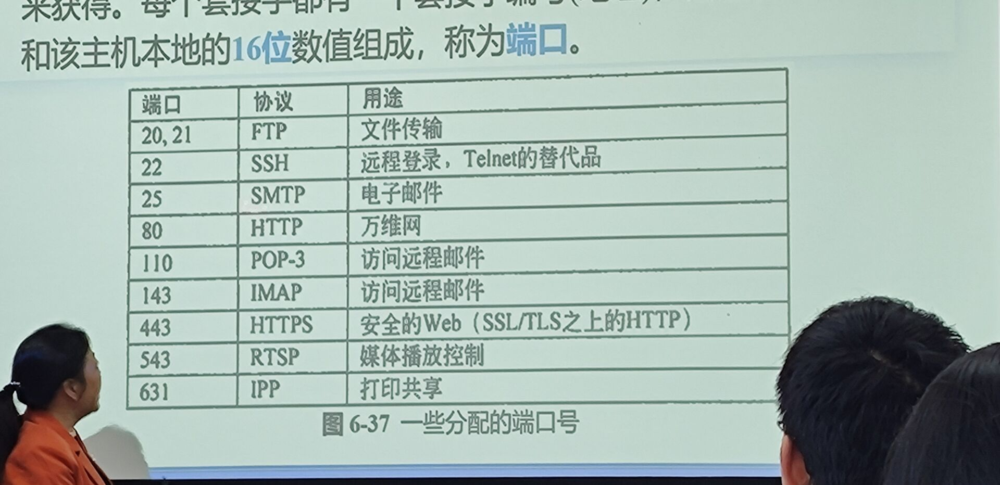

#计网 

# 6.1 传输服务
1. 提供给上层的服务
	1. 传输实体：提供服务的硬件或软件
	2. 传输层提供端到端服务
		1. 网络通信的本质：进程通信
		2. ip 协议提供的服务是不可靠的（数据部分不校验，分组有生存期，拥塞时可以丢弃分组，等等）
		3. **传输层为应用层提供两类服务**
			1. 面向连接的服务：**TCP**传输控制协议
			2. 无连接的服务：**UDP**（User datagram protocol）用户数据报协议
2. 服务原语
3. 伯克利套接字

# 6.2 传输协议的要素

1. 与数据链路层的比较
	1. 相同
		1. 可靠的数据传输
	2. 不同点
		1. 数据链路层通过物理通道直接通信，传输层面对的传输通道是一个**网络**
		2. 数据链路层连接很简单，传输层要复杂得多。
		3. 数据链路层的通信是点到点的，一条输出线对应了一个唯一的设备；传输层则需要给出目的端地址
		4. 数据链路层无中间存储环节；传输层，子网每一途径的路由器都必须要**存储、寻径、转发**
		5. 数据链路层使用一队发送缓冲区和接收缓冲区；传输层对每个连接都必须分配一定的缓冲区，其**缓冲区的管理**将**复杂**得多
2. 寻址（端口号）
	1. > IP 地址是 NSAP 的实例
	2. >tcp 协议中传输层地址即 TCP 的端口号
	3. 端口的定义
		1. 1
		2. 2
		3. 3
3. 端口
	1. 端口用一个 **16bit** 端口号进行标志
	2. 端口号只具有本地意义，即端口号只是为了标志本计算机应用层的各进程
	3. 两类端口
		1. 熟知端口
			1. 0-1023
			2. Web HTTP：80
			3. File FTP：20 和 21
			4. Email SMTP：25
			5. 当一种新的应用程序出现时，必须为他指派一个熟知端口
		2. 一般端口
			1. 1024-65535
			2. 用来随时分配给请求通信的客户进程
	4. 套接字（socket）的构成：ip 地址+端口号
4. 建立连接
	1. 通信子网的不可靠性
	2. 通信子网中存在延时、数据包的丢失，以及由于延时和丢失带来的重复数据包
	3. 有必要控制数据包的生命周期
	4. 处理过期分组，保证连接的唯一性
	5. **三次握手法** ^fead0c
		1. 正常的建立过程
			1. A 为发送端，B 为接收端
			2. CR （seq=x）（连接请求）A->B
			3. ACC（seq=y，ACK=x）（接收连接）B->A
			4. DATA（seq=x，ACK=y）A->B
		2. 非正常的 1
			1. x 超时的情况
			2. CR (seq=x) A->B
			3. ACK (seq=x, ACK=y) B->A
			4. REJECT (ACK=y) A->B
			5. B 收到拒绝信息后，放弃该连接
		3. 非正常的 2
5. 连接的释放
	1. 非对称
		1. 一方中止连接，则连接即告中断
		2. 导致数据丢失
	2. 对称
		1. A 提出请求，B 同意即终止
		2. 三次握手正常情况
			1. DR A->B （断开连接请求）
			2. DR B->A
			3. ACK A->B （确认断开连接）
		3. 主机发送 DR 时启动计时器，在超时后还未收到对方回复，则：
			1. 发送方：再次发送 DR
				1. 连续多次超时，释放连接
			2. 接收方：直接释放连接
6. 差错控制和流量控制
	1. 检验和保护跨越整个网段路径的段，这是一个端到端的校验机制
	2. 使用更大的滑动窗口
7. 多路复用
8. 崩溃恢复
	1. 重发
	2. 重新建立连接
	3. 交由应用层解决
	4. 等等

# 6.4 Internet 传输协议：UDP
1. 域名系统 DNS、简单网络管理协议 SNMP 用的都是 UDP
2. 头格式
	1. 32 位，4 个字段
	2. 源端口 16 位
	3. 目标端口 16 位
	4. udp 长度 16 位
		1. 整个数据段的长度，包括头部和数据部分**以字节计**
		2. 最小为 8 字节（两个 32 位字）（只有头部长度）
		3. 最大为 65515 字节（65535减去 ip 头 20 字节）
	5. udp 校验和 16 位
3. udp 数据包的封装
	1. ip 数据报=ip 头+**ip 数据区**=ip 头部+**udp 头部+udp 数据区**
4. 应用
	1. 远程过程调用 RPC
		1. 向一台远程主机，发送一个消息，并获得一个应答
	2. 实时传输协议 RTP
		1. 传输层协议，再应用层实现
		2. **用于多媒体数据传输**
		3. 将多个实时数据流多路复用到一个 UDP 流上，UDP 流被送给某个地址（单址传输）或多个地址（多址传输）
	3. 实时传输控制协议 RTCP
		1. 处理反馈、同步和用户接口等信息，不传输数据
		2. 反馈信息
		3. 同步
		4. 提供一种对不同的源端进行命名的方法

# 6.5 （重点）TCP
1. 面向连接
2. 使用套接字(socket)：ip 地址和端口
	1. 
	2. 一个套接字允许被多个连接同时使用，即多个连接可以同时连接到同一个套接字上
3. tcp 服务特点
	1. 面向连接
	2. 端到端的服务
	3. 完全可靠的服务
		1. ip 协议不提供可靠的服务，tcp 将在 ip 的基础上提高可靠服务并保证数据发送和接收次序一致
	4. 全双工服务
	5. 流接口
	6. 可靠的连接建立
	7. 完美的连接终止
4. 构成
	1. 面向字节
		1. 把报文看成字节组成的数据流，按照**字节编号**
	2. 建立连接时，双方商定初始序号
	3. **确认号**是已收到的数据的最高序号**加一**
		1. 表示接收端期望**下次**收到的数据中的第一个数据字节的序号
	4. 报文构成
		1. 
		2. 源端口和目标端口字段各占两个字节 （32 位）
		3. 序号字段---  四字节（32 位）
			1. 传输流中第一个字节的序号
			2. 长度限制了数据长度最多为 $2^{32}字节$
		4. 确认号---四个字节（32 位）
			1. 表示接收端期望**下次**收到的数据中的第一个数据字节的序号
			2. 发送方的确认号不做要求，确认号无效
		5. tcp 头长度---四**位**
			1. 表示 tcp 头部包含多少个 32bit 的字
			2. 单位为字节
		6. 保留位 --- 四位
			1. 全 0
		7. 标志位 --- 八位
			1. CWR：拥塞控制
			2. ECE：拥塞控制
			3. URG
				1. 1：紧急指针字段有效，表示报文中有紧急数据，应尽快传送（高优先级）
			4. ACK
				1. 1：确认字段有效
			5. PSH
				1. 推送比特。1：尽快交付给应用进程，不用等缓存满了才上交
			6. RST
				1. 复位比特。1：出现严重错误，必须释放连接，再重新建立连接
			7. SYN
				1. （重要）同步比特。1：这是一个连接请求，或连接接受报文
				2. 在三次握手的时候用 [三次握手](#^fead0c)
			8. FIN
				1. 终止比特。1：数据发送完毕，连接释放
		8. 窗口 ---16 位/2 字节
			1. 接收窗口的大小，通知对方以确认发送窗口的大小
		9. 校验和 --- 16 位         2 字节
			1. 在计算校验和时，要在报文段前加上 12 字节的伪首部
		10. 紧急指针 --- 16 位
			1. 本报文段中，紧急数据的最后一个字节位置
		11. 可选项 -- 0 或多个 32 位字
			1. MSS，数据字段的最大长度
5. 连接建立
	1. 三个阶段
		1. 连接建立
		2. 数据传送
		3. 连接释放