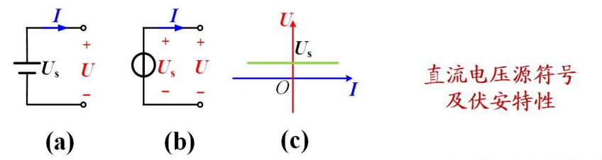
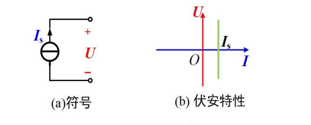

#直流电路
## 电流$I$

$I = \frac{Q}{t}$

随时间变化的$i = \frac{dq}{dt}$ 

注意电流的参考方向, 同向为正

## 电压$U$

直流电压:            $U_{ab} = \frac{W_{ab}}{Q}$

时变电压             $u_{ab} = \frac{dw_{ab}}{dq}$

参考方向正极性指向负极性

>   关联参考方向: 电压的方向和电流的方向一致
>
>   非关联参考方向: 方向相反

## 功率$P$

$p(t) = \frac{dw}{dt}$

$p(t) = u(t)i(t)$

在直流电路中 $P=UI$

若$P>0$则该元件或电路吸收功率; 若$P<0$, 则该元件或电路发出功率, 即起电源作用

功率平衡原理: 在完整电路中, $\sum{P}=0$

对于一个二端元件, 电压与电流为关联参考方向时$p=ui$, 非关联参考方向时$p=-ui$

## 电阻$R$

欧姆定律公式: $u=Ri$

非关联参考方向时 $u=-Ri$

元件的电压与电流之间的关系称为**伏安关系(VAR)**, 线性电阻元件的伏安特性曲线是过原点的一条直线

当电阻元件上**电流**恒为零时, 即$I \rightarrow +\infty$, 称为**开路**

>   导线断开

当电阻元件上**电压**恒为零时, 即$U \rightarrow +\infty$, 称为**短路**

>   导线直接连在电源两端

线性电阻元件功率$P$在电压和电流的**关联**参考方向下:

$P=\frac{U}{I}=RI^2=\frac{U^2}{R} = GU^2$

### 电导(G)

电阻的倒数,单位为西门子($S$)

$i=Gu$	

>   $i=\frac{u}{R}=Gu$

## 电压源与电流源

### 理想电压源$U_s$

电压恒定, 电流由外界电路确定.

​	符号中间的杠和导线方向一致

>   电压源的电压可以为0, 电压为0的电压源相当于短路线

### 理想电流源$I_s$

电流恒等, 电压由外界电路确定. 

​	符号中间的杠和导线垂直

>   电流源的电流可以为0, 电流为0的电流源相当于断路

## 实际电源$R_s$

实际电源由内阻$R_s$, 使用时间不同, 输出电流值和电压值会变化. 会产生热量$P_热=I^2R_s$, 输出电压降低$U_{输出}=U-IR_s$

### 实际电压源

由理想电压源$U_s$和内阻$R_s$**串联**组成

实际电压源伏安关系为

$U=U_s-R_sI$

开路电压$U_{OC} = U_s$

短路电流$I_{SC} = \frac{U_S}{R_S}$

### 实际电流源

由理想电流源$I_S$和内阻$R_S$并联

伏安关系为

$I=I_S-\frac{U}{R_S}$

开路电压$U_{OC}=R_SI_S$

短路电流$I_{SC}=I_S$

## 基尔霍夫定律

支路: 每一个二端元件就是一条支路. 一条支路流过一个电流, 称为支路电流.

节点: 三条或三条以上支路的联接点

分段点: 元件与元件的联接点

回路: 由支路组成的闭合路径

### 基尔霍夫电流定律(KCL)

任一时刻流出(流入)任一**节点**电流的代数和等于0, 或任一时刻, 流入任一**节点**的电流之和等于流出该**节点**的电流之和

$\sum{I} = 0$ 	或	$\sum{I_{in}} = \sum{I_{out}}$

### 基尔霍夫电压定律(KVL)

沿任一闭合回路绕行一周, 各支路电压的代数和为0

$\sum U = 0$

元件两端电压的方向与回路绕行的方向一致取正,相反取负

## 电位$V$

>   同物理学中的电势

需要选取参考点, 该点电位规定为0, 用符号`⊥`.  其他点的电位$V$就是该点与参考点之间的电压$U$. 两点之间的电压等于两点之间的电位差

电压的参考方向下, 电位降低

### 利用电位可以将电路简化

省略电压源符号, 只标注出电位的大小和极性

## 单口网络及等效

单口网络是指只有一个端口与外部电路连接的电路, 端口有两个端钮, **流入**一个端钮的电流等于**流出**另一个端钮的电流. 两个单口网络$N1$和$N2$, 如果伏安关系$VAR$完全相同, 则两个单口网络是等效的.

>   等效是指对外电路等效, 内部结构不一定一样
>
>   端口:
>
>   1、定义：如果两个接线端，从一个接线端流入的电流等于从另一个接线端流出的电流，那么这两个接线端就构成了一个端口
>
>   2、形成端口所需要的条件称为端口条件
>
>   3、两个接线端的元件一定是一个端口
>
>   4、如果一个电路有四个接线端，它们分成两组可以分别构成两个端口，那么这个端口叫做二端口 
>
>   作者：归逝风翼 https://www.bilibili.com/read/cv12688110/ 出处：bilibili

### 电阻的串联及等效

串联电路的等效电阻:$R_总 = \sum R_i$

第k条支路的电压:$U_k = \frac{R_k}{\sum_{i=1}^{n}R_i}U$

### 电阻的并联及等效

等效电阻满足$\frac{1}{R} = \frac{1}{R_1}+\frac{1}{R_2}+\cdots+\frac{1}{R_n}$

$I=I_1+I_2+\cdots+I_n=(\frac{1}{R_1}+\frac{1}{R_2}+\cdots+\frac{1}{R_n})U=(G_1+G_2+\cdots+G_n)U = GU$

### 理想电压源的串联及等效

n个理想电压源**串联**起来

$u_S=\sum_{k=1}^n u_{Sk}$

### 理想电流源的并联及等效

n个理想电流源**并联**起来

$i_S= \sum_{k=1}^{n} i_{Sk}$

### 理想电压源与元件的并联及等效

电压源和一个元件并联, 对于**外电路**而言可以等效成电压源本身. 如果并联的元件是电压源, 则要求两个电压源的**极性**和**大小**相同, 否则禁止将两个电压源并联在一起

(电压源直接把这个元件吃掉惹)

### 理想电流源与元件的串联及等效

电流源和一个元件串联, 对于**外电路**而言可以等效成电流源本身. 如果并联的元件是电流源, 则要求两个电流源的**极性**和**大小**相同, 否则禁止将两个电压源并联在一起

### 实际电压源与实际电流源的等效

满足两个电源的VAR完全相同时, 两个电路等效

>   当电压源正极性在上时, 电流源的箭头方向向上

例如:

电压源$U_S$与电阻$R_S$串联, 他们的VAR为$U=U_S-R_SI$

电流源$I_S$与电阻$R_0$并联, 他们的VAR为$U=R_0(I_S-I)=R_0I_S-R_0I$

当满足$R_S=R_0$,且$U_S=R_0I_S$时,VAR相同, 则他们等效

## 电路分析的基本方法

### 节点电位分析法

-   选择某一节点为电位参考点(电位为0)
-   列出独立节点的KCL方程. 一般来说, 对具有n个节点的电路运用基尔霍夫电流定律只能得到(n-1)个独立的KCL方程
    -   这里设节点连接的支路电流为$I_i$, $\sum I_i = 0$
-   用节点点位表示支路电流
    -   设节点的电位为$V_i$
    -   每个支路的两端肯定是独立节点, 这条支路的电压$U = V_a - V_b$
    -   这条支路的电阻通过等效电阻计算
    -   最后可以求出这条支路的电流$I = \frac{U}{R}$
-   整理方程并求解
    -   将各个支路电流带入到第二步的式子中

>   什么是独立的?
>
>   ​	应该是指这个节点和其他节点之间是有元件隔开的, 不能是导线直接相连的节点

### 支路电流法

-   标出`m`条未知支路电流的参考方向

    -   先判断独立节点, 独立节点两两之间为未知支路

-   列KCL方程

    -   `n`个独立节点一般能列`n-1`个KCL

-   列独立的KVL方程

    -   独立的KVL方程数为$m-(n-1)$

    -   >   独立回路的定义：每定义一个独立回路，之中必须、至少有一条未被使用过的支路，直到所有的支路都被用过为止

    -   >   独立回路找法很简单，做题没特殊要求的话直接找网孔就可以。一般来讲，就是每次从一个没被包含过的支路找起，找到的回路就是独立回路。

-   联立求解

## 电路分析的基本定理

### 叠加定理

>将多个电源分开计算其对各个支路的贡献

在线性电路中有多个电源同时作用时, 电路中任何一条支路的电流(或电压), 都等于电路中各个电源单独作用时, 在此支路中所产生的电流(或电压)的代数和. 

某个电源单独作用时, 其他电流源$I$置零相当于开路, 其他电压源$U$置零相当于短路

>叠加定理只适用于线性电路, 线性电路的电流或电压均可用叠加定理计算, 但功率$P$不能用叠加定理计算, 因为功率不是电压或电流的线性一次函数

### 等效电源定理

一个有源线性单端口网络,( 有电源的, 只有一个端口的) 对其外电路来说, 总可以用一个等效电源模型来代替, 当等效电源模型为**实际电压源**时, 称为**戴维南定理**; 当等效电源模型为**实际电流源**时, 称为**诺顿定理**

#### 戴维南定理(求电压的)

任何一个有源二端线性网络(有电源的, 有两个接线端), 都可以用一个电压源和电阻**串联**来等效代替. 

等效电压源的电压等于有源二端网络的开路电压$U_{OC}$, 串联电阻$R_O$等于有源二端网络中所有电源置零(**电压源短路, 电流源开路**)后所得到的无源二端网络的等效电阻

-   先将需要求解的**支路断开**, 即分出一个有源二端网络
    -   此时可以计算这个有源二端网络的等效电压源$U_{OC}$
        -   可以使用叠加原理等方法
-   将网络中的电压源短路, 电流源开路
    -   求出这个网络的等效电阻$R_O$
-   将等效电压源和等效电阻**串联**, 在与需要求的支路**串联**
    -   求出支路的相关数据

#### 诺顿定理(求电流的)

任何一个有源二端线性网络(有电源的, 有两个接线端), 都可以用一个电流源和电阻**并联**来等效代替. 

等效电流源的电流等于有源二端网络的短路电流$I_{SC}$, 并联电阻$R_O$等于有源二端网络中所有电源置零(**电压源短路, 电流源开路**)后所得到的无源二端网络的等效电阻

-   先将需要求解的**支路短路**, 即合出一个有源二端网络
    -   此时可以计算这个有源二端网络的等效电流源$I_{SC}$
        -   可以使用叠加原理等方法
-   将网络中的电压源短路, 电流源开路
    -   求出这个网络的等效电阻
-   将等效电压源和等效电阻**并联**, 在与需要求的支路**并联**
            -   求出支路的相关数据

-----------
-----------
------------

# 一阶动态电路的暂态分析

含有动态元件的电路称为**动态电路**, 动态电路从一个状态变化到另一个状态的某一个短暂时间称为 **暂态过程** . 电路从一种稳定状态到另一种稳定状态称为 **暂态分析**. 含有一个储能元件的电路的电压或电流可以用一阶微分方程表示, 所以该电路被称为**一阶电路**

## 电容元件

一种储能元件, **电容量**$C$是其储存点和能力的参数, 单位为**法拉**$F$, 是一种动态元件

当电容的电压与电流为关联参考方向时其伏安特性VAR

$i_C=C\frac{du_c}{dt}$

非关联参考方向时

$i_C =-C\frac{du_C}{dt}$

当电容两端的电压保持不变, 则通过它的电流为0, 对于直流电压而言, 电容相当于开路, 因此电容具有 **隔断直流** 的作用; 交流电压来说, 通过电容的电流不为0, 因此交流信号能够正常流过电容器.

对其伏安特性进行两边积分, 某一时刻$t$电容的电压,取决于从$-\infty$ 到$t$ 所有时刻的电流值的**积累**

$u_C(t) = \frac{1}{C}\int_{- \infty }^{t}i_C(\lambda)d\lambda = u_C(t_0)+\frac{1}{C}\int_{t_0}^{t}i_C(\lambda)d\lambda$			$t>t_0$

没有放电回路则不会放电

## 电感元件

高中学的线圈; **电感量L**是表征电感元件存储磁场能力的参数,单位为**亨**

电压与电流为相关参考方向时的**VAL**:

$u_L=L\frac{di_L}{dt}$

对于直流电流而言, 电感相当于短路

积分式的**VAL**

$i_L(t)=\frac{1}{L}\int_{-\infty}^{t}u_L(\lambda)d\lambda=i_L(t_0)+\frac{1}{L}\int_{t_0}^{t}u_L(\lambda)d\lambda$		$t>t_0$

## 换路定则

电路工作状态改变了, 称为 **换路** 

通常认为换路在$t=0$时刻进行, 用$t=0_-$表示换路前一瞬间, 称为 **起始时刻** ,用 $t=0_+$表示换路后一瞬间, 称为 **初始时刻** ; 初始条件为 $t=0_+$时`u`,`i`的值, 也成为初始值

换路过程中, 因电容电流 电感电压为有限值, 积分项为0

对电容:

$u_C(0_+)=u_C(0_-) + \frac{1}{C}\int_{0_-}^{0_+}i_C(\lambda)d\lambda$

换路过程中, 电容电流为有限值, 则积分项$\frac{1}{C}\int_{0_-}^{0_+}i_C(\lambda)d\lambda$值为0

所以有$u_C(0_+)=u_C(0_-)$

对电感:

$i_L(0_+)=i_L(0_-) + \frac{1}{L}\int_{0_-}^{0_+}u_L(\lambda)d\lambda$

积分项为0

所以有:$i_L(0_+)=i_L(0_-)$

## 初始值的确定

-   先由$t=0$等效电路求出$u_C(0_-)$或$i_L(0_-)$: 在直流激励下, 换路前, 电路已处于稳定状态时, 将电容$\rightarrow$开路, 电感$\rightarrow$短路, 得到$t=0_-$等效电路
    -   题目会给出$0_+$或者$0_-$是稳定的, 就可以根据电路求出其中一个的电压或着电流
-   根据换路定则, 求出独立变量初始值$u_C(0_+)$和$i_L(0_+)$
    -   求出另一个
-   画出在$t=0_+$时刻的等效电路: 可用电压为$u_C(0_+)$的电压源替代电容, 用电流为$i_L(0_+)$的电流源代替电感
-   由$0_+$电路求所需各变量的$0_+$值
    -   利用之前的内容求值

## 求解一阶电路全响应

### 一阶电路全响应

-   响应
    -   电路中的未知变量, 例如支路电流支路电压等
-   激励源:
    -   独立电源
-   全响应
    -   由独立电源和储能元件(电容电感)的初始状态共同引起的响应

### 三要素法

分析初始值, 稳态值, 和时间常数$\tau$

一阶电路的响应变量可能是电压或电流, 统一用$f(t)$代替

$f(t)=f(\infty)+[f(0_+)-f(\infty)]e^{-{\frac{t}{\tau}}}$

-   $f(0_+)$为初始值, 
-   $f(\infty)$为稳态值
    -   根据$t>0$时的等效电路, 将电容用开路代替或着电感用短路代替
-   $\tau$
    -   戴维南等效电阻$R_O$
        -   在$t>0$时的等效电路中, 将所有的独立电源置零(电压源短路, 电流源开路), 然后从电容或电感两端看进去, 此时的线性电阻单口网络的总电阻为$R_O$
    -   对于RC电路
        -   $\tau = R_OC $     
    -   对于RL电路
        -   $\tau = \frac{L}{R_O}$  		
-   将$f(t)$换为$u$或$i$
    -   带入求解

### 一阶电路零输入响应

动态元件在换路前收到电源影响, 换路后的电路中只存在动态元件而不存在电源

三要素法求响应

### 一阶电路零状态响应

换路前动态元件不存在于电路中, 换路后动态元件加入到了电路中

# 正弦稳态电路分析

